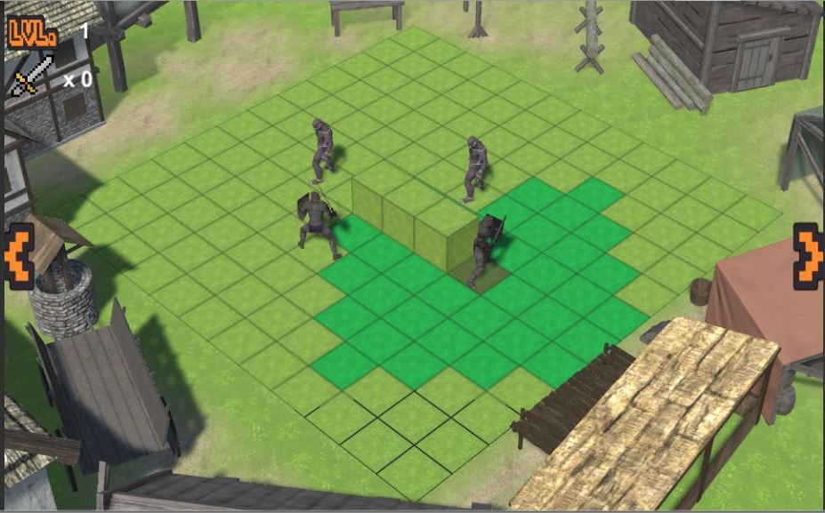

GridFighter is a turn based combat game, where your objective is to defend a town from a monster attack, to do that you'll need to defeat waves of enemies.
 

Play here: https://guipleite.itch.io/gridfighter
 

Controls:

    - To move or attack, click on one of the squares highlighted in green.
    - To skip a turn, click on the gray square below the character.
    - To rotate the camera, use the arows in the edges of the screen .

All files including the Store Assets:https://alinsperedu-my.sharepoint.com/:u:/g/personal/guilhermepl3_al_insper_edu_br/Eac-Kqr3qxRJsHKVA7UlfFoB1gnlFe-1BjDf_pillYlZIQ?e=DrEDL3

Guilherme Leite e Gabriel Monteiro 
